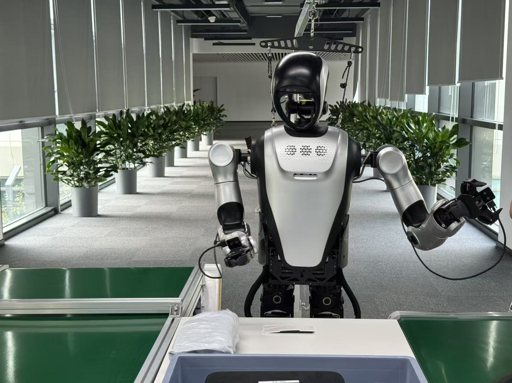

.. _task:

********************
Task Description
********************

At its core, this competition is based on real dual-arm humanoid robots, with several tasks thoughtfully prepared that are highly representative of typical industrial applications workflow. In addition, a simulation environment that closely resembles the task workflows of the real robot is also provided, along with open access to high-quality task datasets, evaluation scripts, complete execution pipelines, online evaluation servers and ready-to-run baseline code. 
The simulation track is especially designed for competitors to familiarise themselves with the Kuavo robot dataset formats, algorithm development and algorithm testing with our baseline code. It also simulates and selects teams with highly matured algorithms that are highly worthy of real-robot competition in a fair manner.

Simulation Task Description
================================

Task 1: Parcel Weighing - Task Difficulity 1.0
----------------------------------------------------------------

In this task, the robot is required to pick up a soft-pouch express parcel from a moving conveyor belt, place it on an electronic scale for weighing, and then transfer it to another conveyor belt.

Within this task, the lighting/reflection, colours, and the positioning of the parcel and the scale will be randomised within a reasonable range.

Each task is out of 100 base points as the base task score.

- Scoring standards:
    a. 25 pts for the successful grasp of the object from the conveyor belt

    b. 25 points for the subsequent correct placement of the object onto its desginated area (the electronic scale)

    c. 25 pts for picking it up from the scale

    d. 25 pts for the correct placement/orientation of the object

.. image:: ../_static/images/task1_sim.png

Task 2: Part Sorting - Task Difficulity 1.5
----------------------------------------------------------------

In this task, the robot needs to pick up a component chosen from different categories representative in the industrial setting, lying in a randomised orientation on a moving conveyor belt, and then place the component into the correct sorting bin.

Within this task, the lighting/reflection, colours, and the positioning of the component and the bins will be randomised within a reasonable range.

- Scoring standards:
    a. 50 pts for picking up the component from the conveyor belt

    b. 50 pts for placing it into the correct bin

    c. 20 bonus pts for completing it within a specified timeframe. An 1-pt penalty will be applied for every second elapsed outside of this timeframe

.. image:: ../_static/images/task2_sim.png

Task 3 Details to be Unveiled... Stay Tuned!
----------------------------------------------------------------------------

.. Task 3: Full-cycle Plate Transferral - Task Difficulity 2.5
.. ----------------------------------------------------------------------------

.. In this task, the robot needs to move to a specified location in front of the plate shelf, picks up the plate from the slot indicated by a red light, then turns around and places it into the target container.

.. Within this task, the robot will start from a reasonable randomised location, the illumination of the red light is randomised, and the location of the target container is randomised.

.. - Scoring standards:
..     a. 25 pts for moving to the correct target area in front of the tray shelf

..     b. 25 pts for the successful pickup of the desginated plate

..     c. 25 pts for moving to the correct area in front of the destination

..     d. 25 pts for successful placement of the tray

.. .. image:: ../_static/images/task3_sim.png

Real-machine Task Description
==================================

Task 1: Parcel Weighing - Task Difficulity 1.0
----------------------------------------------------------------

In this task, the robot is required to pick up a soft-pouch express parcel from a moving conveyor belt, place it on an electronic scale for weighing, and then transfer it to another conveyor belt.

Within this task, the lighting/reflection, colours, and the positioning of the parcel and the scale will be randomised within a reasonable range.

Each task is out of 100 base points as the base task score.

- Scoring standards:
    a. 25 pts for the successful grasp of the object from the conveyor belt

    b. 25 points for the subsequent correct placement of the object onto its desginated area (the electronic scale)

    c. 25 pts for picking it up from the scale

    d. 25 pts for the correct placement/orientation of the object

Task 2: Part Sorting - Task Difficulity 1.5
----------------------------------------------------------------

In this task, the robot needs to pick up a component chosen from different categories representative in the industrial setting, lying in a randomised orientation on a moving conveyor belt, and then place the component into the correct sorting bin.

Within this task, the lighting/reflection, colours, and the positioning of the component and the bins will be randomised within a reasonable range.

- Scoring standards:
    a. 50 pts for picking up the component from the conveyor belt

    b. 50 pts for placing it into the correct bin

    c. 20 bonus pts for completing it within a specified timeframe. An 1-pt penalty will be applied for every second elapsed outside of this timeframe

.. image:: ../_static/images/task2_real.jpeg

Task 3 Details to be Unveiled... Stay Tuned!
----------------------------------------------------------------------------

.. Task 3: Full-cycle Plate Transferral - Task Difficulity 2.5
.. ----------------------------------------------------------------------------

.. In this task, the robot needs to move to a specified location in front of the plate shelf, picks up the plate from the slot indicated by a red light, then turns around and places it into the target container.

.. Within this task, the robot will start from a reasonable randomised location, the illumination of the red light is randomised, and the location of the target container is randomised.

.. - Scoring standards:
..     a. 25 pts for moving to the correct target area in front of the tray shelf

..     b. 25 pts for the successful pickup of the desginated plate

..     c. 25 pts for moving to the correct area in front of the destination

..     d. 25 pts for successful placement of the tray

.. .. image:: ../_static/images/task3_real.jpeg