.. _vienna::

***************************
Vienna On-Site Competition
***************************

Vienna On-Site Competition Preparation
======================================

In the Vienna on-site competition, the participant workflow remains consistent with the real-robot track:

1. Use the same project codebase and runtime logic as the real-robot competition.
2. Modify configuration files using the same principles and fields as the real-robot competition.
3. Follow the same submission packaging process for deployment and evaluation.

Vienna On-Site Dataset
======================

Vienna on-site dataset:
`Vienna dataset on HuggingFace <https://huggingface.co/datasets/LejuRobotics/kuavo_data_challenge_icra/tree/main/vienna>`_

On-Site Task Description
========================

Task Overview
-------------

Task 1
^^^^^^

Metal Parts Righting
Overall Task:
Small parts are placed both face-up and face-down on a conveyor belt. The robot must grasp face-down parts with one hand, flip them, and place them face-up.

Level 1 Scenario Video:

.. video:: ../_static/videos/vienna_task1_level1.mp4
   :width: 100%
.. raw:: html

   

Level 2 Scenario Video:

.. video:: ../_static/videos/vienna_task1_level2.mp4
   :width: 100%
.. raw:: html

   

Task 2
^^^^^^

Daily Chemical Bottle Pick & Place
Overall Task:
Bottles of identical specifications are randomly placed on a tabletop within the right hand's working radius. The right hand grasps each bottle and transfers it mid-air to the left hand, which then places it onto a conveyor belt. The conveyor belt work area falls within the field of view of the robot's head-mounted camera.

Level 1 Scenario Video:

.. video:: ../_static/videos/vienna_task2_level1.mp4
   :width: 100%
.. raw:: html

   

Level 2 Scenario Video:

.. video:: ../_static/videos/vienna_task2_level2.mp4
   :width: 100%
.. raw:: html

   

Task 3
^^^^^^

Express Package Scanning
Overall Task:
Grasp parcel from conveyor belt with one hand, place it on the label-scanning platform; left hand adjusts the parcel label face-up, then grasps with one hand and places on the conveyor belt on the other side.

Level 1 Scenario Video:

.. video:: ../_static/videos/vienna_task3_level1.mp4
   :width: 100%
.. raw:: html

   

Level 2 Scenario Video:

.. video:: ../_static/videos/vienna_task3_level2.mp4
   :width: 100%
.. raw:: html

   

Task Scoring
------------

General Rules
^^^^^^^^^^^^^

The on-site competition features three scenarios. Each scenario has two difficulty levels with different scoring configurations.

Evaluation Limit — Each submitted model may attempt up to 3 evaluations per scenario; the average score is taken.

Data Collection — 200 data samples are collected per task: 100 for Level 1 and 100 for Level 2 scenarios.

Inference Failure — If a single scoring action fails 3 consecutive attempts, the round is deemed failed. Any collision or abnormal event also results in round failure.

Task 1: Metal Parts Righting (10 pts)
--------------------------------------

Level 1 (Total Score: 6 pts)：
The conveyor belt is stationary. Within the robot's right-hand reach, there are 3 face-down metal parts placed at random positions. The gripper grasps each part and completes the flip.

Time limit per evaluation: 3 minutes.

* 1.5 pts per successfully grasped-and-flipped face-down part.
* 1.5 pts completion bonus for flipping all required parts.

Level 2 (4 pts):
The conveyor belt is moving. There are 4 small parts: 2 face-down and 2 face-up, placed randomly within the right hand's reach. The right hand grasps face-down parts from the moving belt; face-up parts are identified but not manipulated.

Time limit per evaluation: 5 minutes.

* 1 pt per successfully grasped-and-flipped face-down part.
* 1 pt per correctly identified face-up part with correct move-away behavior.

Task 2: Daily Chemical Bottle Pick & Place (15 pts)
------------------------------------------------------

Level 1 (5 pts):
The right hand grasps one bottle and performs a mid-air handoff to the left hand, which then places the bottle steadily onto the conveyor belt.

Time limit per evaluation: 3 minutes.

* 1 pt for successfully grasping the bottle without dropping.
* 2 pts for successful bimanual handoff.
* 2 pts for stable placement on the conveyor belt.

Level 2 (10 pts)：
Two bottles of identical specifications are randomly placed within the right hand's working radius. The right hand grasps each bottle one at a time and performs a mid-air handoff to the left hand, which then places the bottles onto the conveyor belt one by one in a stable manner.

Time limit per evaluation: 6 minutes.

* 1 pt per bottle for grasping without dropping.
* 2 pts per bottle for successful bimanual handoff.
* 2 pts per bottle for stable placement on the conveyor belt.

Task 3: Express Package Scanning (25 pts)
------------------------------------------

Level 1 (10 pts)：
Two parcels are placed one at a time: one label-up and one label-down. The right hand grasps a nearby parcel and places it on the scanning platform; the left hand flips the label-down parcel and places it on the conveyor belt.

Time limit per evaluation: 6 minutes.

* 1 pt per parcel for grasping and placing on the scanning platform.
* 4 pts for successfully flipping a label-down parcel and placing it correctly on the scanning platform.
* 2 pts per parcel for successful placement on the conveyor belt.

Level 2 (15 pts)：
Three parcels are placed simultaneously within the right hand's reach: 1 label-up and 2 label-down. The right hand grasps a nearby parcel and places it on the scanning platform; the left hand flips label-down parcels and places them on the conveyor belt.

Time limit per evaluation: 10 minutes.

* 1 pt per parcel for grasping and placing on the scanning platform.
* 3 pts per label-down parcel for successful flipping and correct placement on the scanning platform.
* 2 pts per parcel for successful placement on the conveyor belt.

Vienna On-Site Process Differences
==================================

Compared with the regular real-robot track process, the Vienna on-site process includes these differences:

1. Submission path: Teams may submit via the ICRA official website, or directly deploy/download to the on-site evaluation host for evaluation.
2. On-site scoring: Officials perform on-site scoring and present a live leaderboard.
3. Compute resources: To accelerate iteration, each team is provided with 4 GPU server slots. Resource allocation is expected to be announced before the competition starts so teams can pre-configure environments.
4. Data transfer: On-site collected data is stored on local hard drives. Teams can upload data to training servers via on-site hard drives, or download from HuggingFace directly (on-site hard-drive quantity is limited).

Vienna On-Site Workflow Diagram
===============================

On-Site Schedule
================

.. raw:: html

   <iframe src="../_static/docs/REAL-I_Competition_Guide.pdf" width="100%" height="900px" style="border: 1px solid #ddd;"></iframe>
