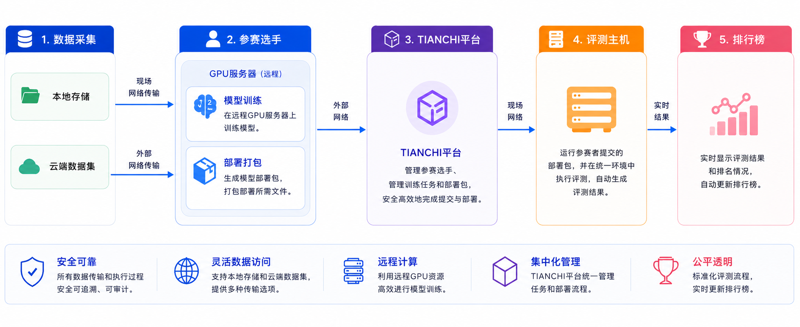

.. _beijing:

**********
北京线下赛
**********

北京线下赛说明
==============

天池线下赛将在北京举办。线下赛阶段延续真机赛的技术路线、任务设置与评测方式，参赛队伍应基于真机赛阶段的代码、模型和部署流程完成现场准备与评测。

参赛队伍需重点关注以下事项：

1. 使用与真机赛一致的项目代码仓库、运行逻辑和模型部署方式。
2. 按照真机赛配置要求，完成数据转换、模型训练、模型推理和部署配置。
3. 采用 Docker 镜像作为提交和评测载体。
4. 线下赛比赛内容与真机赛保持一致，不新增额外任务类型。

.. note::

   1. 线下赛具体场地、报到时间等现场安排暂未明确，请以后续官方通知为准。
   2. 线下赛通过 `天池平台 <https://tianchi.aliyun.com/competition/entrance/532415>`_ 统一提交，每个任务最多 3 次有效提交。
   3. 线下赛期间，参赛队伍需使用自有 GPU 服务器完成模型训练、调试和镜像准备。

线下赛数据
==========

线下赛任务与真机赛任务保持一致，因此数据格式、话题名称、数据转换方式和推理配置原则均参考 :doc:`real` 页面。

线下赛数据预计发布在 ModelScope 数据集的 ``beijing`` 目录中。当前该目录尚未上传，待官方完成上传后将另行通知。

数据集地址：
`LET-Tianchi-Dataset on ModelScope <https://www.modelscope.cn/datasets/lejurobot/LET-Tianchi-Dataset>`_

.. note::

   线下赛预计为每个任务补充 200 条现场数据，并计划在赛前提供。具体发布时间以后续官方通知为准。

线下赛任务说明
==============

北京线下赛比赛内容与真机赛保持一致，包含 3 个独立任务。每个任务最高 100 分，三项任务总分最高为 300 分。

任务概览
--------

任务1：桌面物料分拣
^^^^^^^^^^^^^^^^^^^^

机器人保持站立姿态，夹取桌面上的安全带、线缆、pin口三类物料，并将其放入对应的空盒位置中。

.. video:: ../_static/videos/task1_real.mov
   :width: 100%

.. raw:: html

   

任务2：工业零件称重
^^^^^^^^^^^^^^^^^^^^

机器人依次抓取机械套管，将套管放置到称重台上完成称重，再从称重台拾起并稳定放入指定收纳筐中。

.. video:: ../_static/videos/task2_real.mov
   :width: 100%

.. raw:: html

   

任务3：汽车大件上料
^^^^^^^^^^^^^^^^^^^^

机器人稳定抓取汽车钣金料，并将其准确放置到指定区域。

.. video:: ../_static/videos/task3_real.mov
   :width: 100%

.. raw:: html

   

任务评分
========

通用规则
--------

1. 线下赛包含 3 个独立任务，每个任务最高 100 分。
2. 每个任务固定进行 3 轮测评，每轮限时 3 分钟；超时后完成的动作不计入成绩。
3. 每轮单独评分，取 3 轮成绩的平均分作为该任务最终得分。
4. 若队伍总分相同，则按所有任务全部轮次的平均完成时间从短到长排序。
5. 推理失败判定：若单次计分操作连续 3 次尝试失败，则该轮判定为失败；出现碰撞或其他异常事件时，该轮同样判定为失败。

任务1：桌面物料分拣（100分）
----------------------------

测评时，现场将随机放置安全带、线缆、pin口三种物料，每种物料各一个，共三个。机器人夹取物品后，需要将其放置到盒子的指定空位处，目标顺序从左到右依次为：pin口、安全带、线缆。

评分标准如下：

* 抓取成功且稳定：10 分/每个物体，共 30 分
* 准确放至指定位置：15 分/每个物体，共 45 分
* 全部完成奖励：25 分

任务2：工业零件称重（100分）
----------------------------

测评时，现场将在指定位置成排放置三个机械套管。机器人需要依次抓取套管，将其放置到称重台上完成称重，再从称重台拾起并稳定放入指定收纳筐中。

评分标准如下：

* 抓取成功且稳定：10 分/每个套管，共 30 分
* 准确放至称重台并完成称重：10 分/每个套管，共 30 分
* 从称重台再次拾取成功：5 分/每个套管，共 15 分
* 稳定放入指定收纳筐：前两个套管各 5 分，最后一个套管 15 分，共 25 分

任务3：汽车大件上料（100分）
----------------------------

测评时，机器人需要稳定抓取汽车钣金料，并将其准确放置到指定区域。

评分标准如下：

* 抓取成功且稳定：40 分
* 准确放至指定位置：60 分

线下赛定位与实施说明
====================

相比常规真机赛远程评测流程，北京线下赛主要存在以下差异：

1. 线下赛比拼：参赛队伍需基于真机赛阶段形成的任务模型，结合线下赛数据进行后训练与优化，重点比拼模型在现场任务数据上的适应能力、泛化能力和稳定部署能力。
2. 现场评测：参赛队伍需在北京线下赛现场完成模型部署和评测确认。
3. 现场沟通：若出现设备异常、网络异常或镜像运行异常，参赛队伍需按照现场工作人员安排处理。
4. 实时排名：线下赛现场将设置实时排行榜，用于展示评测进展和阶段性成绩。

线下赛日程安排
==============

.. note::

   北京线下赛的详细日程、每日开放时间、提交截止时间和颁奖安排暂未明确，请以后续官方通知为准。

线下赛选手工作流
================

线下赛选手手册
==============

.. note::

   北京线下赛选手手册将后续补充说明。
